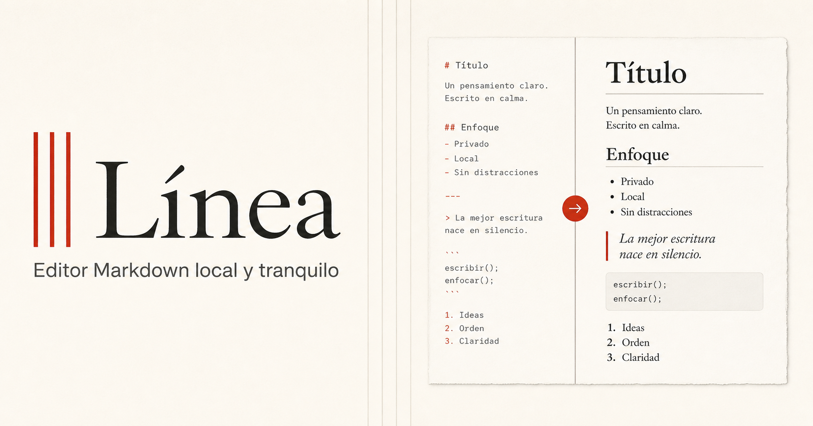
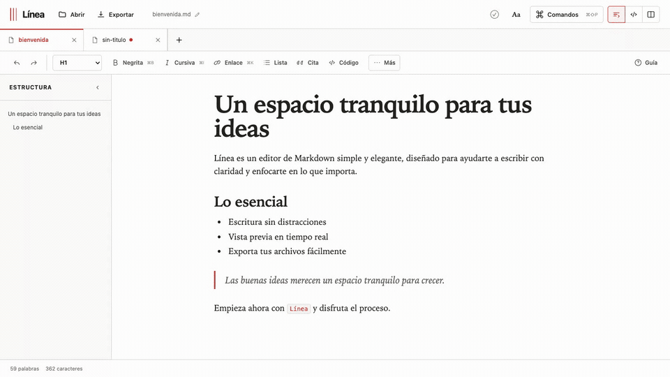

<p align="center">
  <a href="https://linea-markdown-editor.marcgt.chatgpt.site">
    
  </a>
</p>

<h1 align="center">Línea</h1>

<p align="center">
  Un espacio local y tranquilo para escribir Markdown.<br />
  <a href="https://linea-markdown-editor.marcgt.chatgpt.site"><strong>Probar Línea ↗</strong></a>
</p>

<p align="center">
  <a href="#privacidad">Privado por diseño</a> ·
  <a href="#funciones">Escribe con foco</a> ·
  <a href="#ejecutar-en-local">Código abierto</a>
</p>

<table>
  <tr>
    <td width="58%">
      <a href="https://github.com/marc4919/linea-markdown-editor/raw/refs/heads/main/public/linea-demo.mp4">
        
      </a>
    </td>
    <td width="42%" valign="middle">
      <strong>Un editor que deja espacio a las ideas.</strong><br /><br />
      Línea combina una escritura serena con herramientas potentes: Markdown en vivo, edición enriquecida, vista previa, exportación y una organización clara de tus documentos. Todo sucede en el navegador, sin cuentas ni servidores.
    </td>
  </tr>
</table>

| Escribe | Organiza | Comparte |
| :-- | :-- | :-- |
| Markdown, formato enriquecido y atajos pensados para no romper el ritmo. | Pestañas, esquema de encabezados, paleta de comandos y modo concentración. | Exporta tus textos a Markdown, HTML o PDF cuando estén listos. |

## Funciones

- **Tres formas de trabajar:** editor enriquecido, Markdown en vivo y comparación con el resultado renderizado.
- **Todo a mano:** negrita, cursiva, enlaces, listas, citas, código, tablas, Mermaid y notas al pie.
- **Documentos bajo control:** pestañas independientes, recuperación automática, esquema navegable y confirmación ante cambios sin exportar.
- **Diseñado para el ritmo:** selector de encabezados, atajos de teclado, paleta de comandos (`⌘⇧P` / `Ctrl+Shift+P`) y guía rápida.
- **También en móvil:** navegación y modo de enfoque adaptados a pantallas pequeñas.
- **Exportación sencilla:** guarda en Markdown, HTML o PDF desde el diálogo nativo del navegador.

## Ejecutar en local

Requiere Node.js 22.12 o superior.

```bash
npm install
npm run dev
```

Abre la dirección que indique Vite y empieza a escribir.

## Comprobar

```bash
npm run check
```

Este comando ejecuta las pruebas del motor de formato y del modelo de pestañas, seguido del build de producción.

## Privacidad

El contenido se guarda en el almacenamiento local del navegador. No se envía a servidores y la interfaz no carga tipografías ni recursos externos.

**Guardado en Línea** significa que la sesión puede recuperarse en este dispositivo. **Exportado** significa que ya existe una copia descargada por ti.
